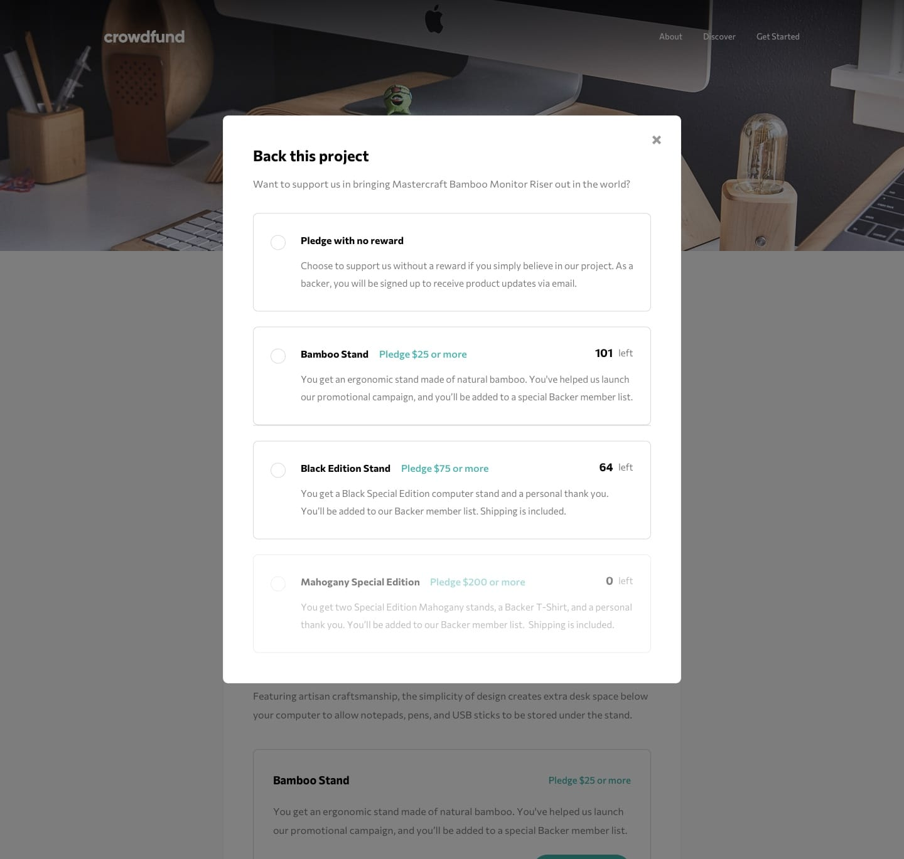
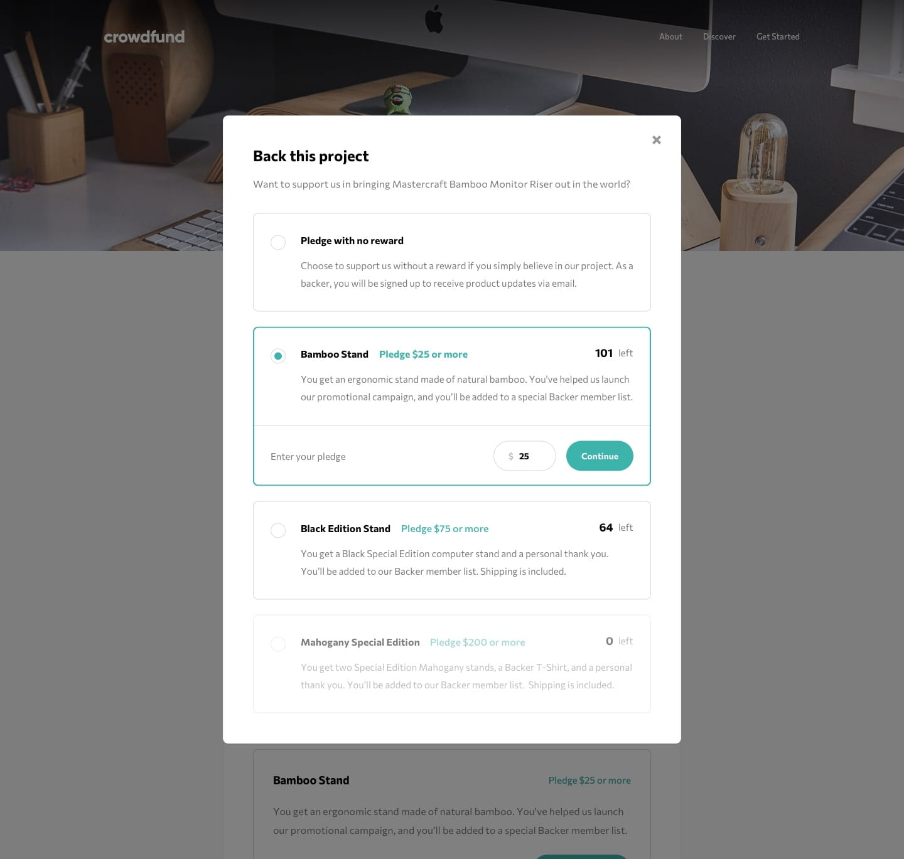
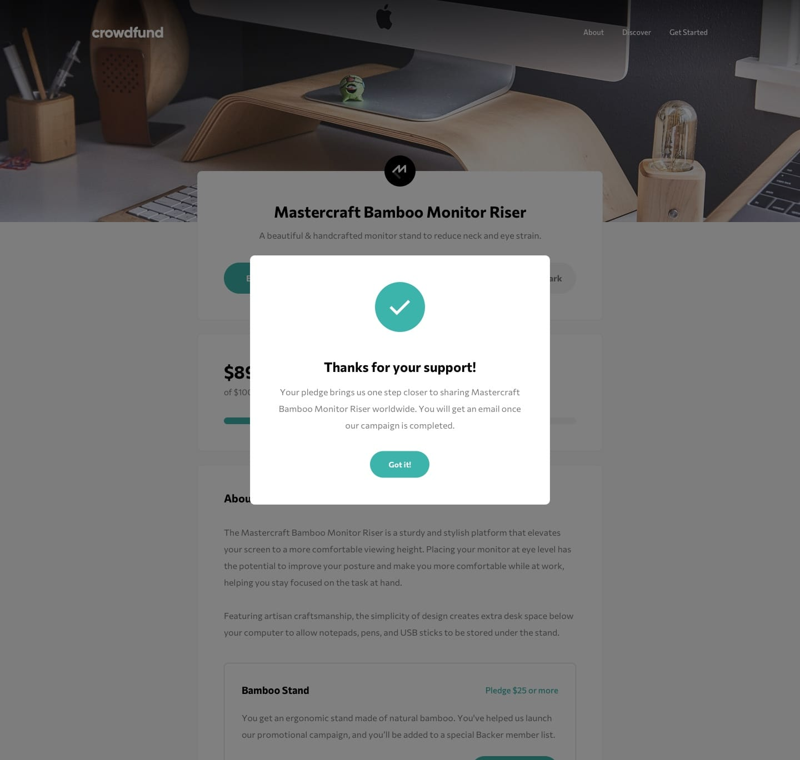

# 🚀 Crowdfunding Product Page

A modern, responsive crowdfunding product page built with React, TypeScript, and Tailwind CSS. This project showcases a beautiful and interactive interface for supporting product campaigns.






## ✨ Features

### 🎯 Interactive Pledge System

- Dynamic pledge selection with real-time updates
- Custom radio button styling with smooth transitions
- Responsive pledge modal with elegant animations
- Smart input validation for pledge amounts

### 💰 Campaign Progress Tracking

- Real-time progress bar visualization
- Dynamic statistics updates
  - Total amount raised
  - Number of backers
  - Days remaining

### 🔖 Bookmark Functionality

- Toggle bookmark state with visual feedback
- Persistent state management
- Custom design with modern hover effects

### 📱 Responsive Design

- Mobile-first approach
- Elegant transitions between viewport sizes
- Custom breakpoints for optimal viewing
- Hamburger menu for mobile navigation

## 🛠️ Built With

- **Frontend Framework**: React with TypeScript
- **Styling**: Tailwind CSS
- **State Management**: React Hooks
- **Font**: Commissioner (400, 500, 700)
- **Design System**: Custom color variables and consistent spacing

## 🎨 Design Features

### Color Palette

- Moderate Cyan: `hsl(176, 50%, 47%)`
- Dark Cyan: `hsl(176, 72%, 28%)`
- Black: `hsl(0, 0%, 0%)`
- Dark Gray: `hsl(0, 0%, 48%)`

### Typography

- Font Family: Commissioner
- Weights: 400 (Regular), 500 (Medium), 700 (Bold)
- Responsive text sizing
- Optimal line heights for readability

## 🚀 Getting Started

1. Clone the repository

```bash
git clone https://github.com/mechitoua/crowdfunding-product-page.git
```

2. Install dependencies

```bash
cd crowdfunding-product-page
pnpm install
```

3. Start the development server

```bash
pnpm run dev
```

4. Open [http://localhost:5173](http://localhost:5173) in your browser

## 💡 Usage

### Making a Pledge

1. Click "Back this project" to open the pledge modal
2. Select your desired reward tier
3. Enter your pledge amount (minimum amount varies by tier)
4. Click "Continue" to confirm your pledge
5. View the success message and updated campaign statistics

### Bookmarking

- Click the bookmark icon to save the project
- The button state and text update to reflect the bookmarked status
- Hover effects provide visual feedback

## 📱 Responsive Breakpoints

- Mobile: 375px
- Desktop: 1440px

## 🌟 Acknowledgments

- Design inspiration from Frontend Mentor
- Icons and images optimized for performance
- Community feedback and contributions

## 📄 License

This project is open source and available under the [MIT License](LICENSE).
